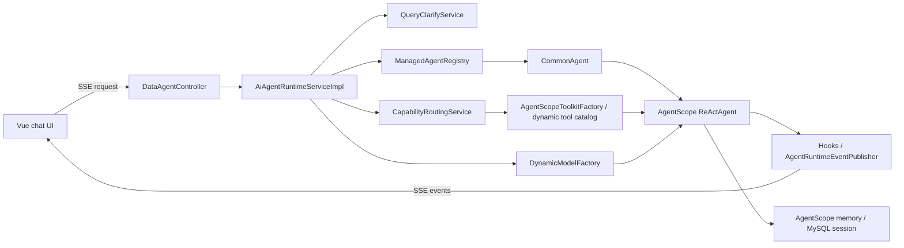

[中文](./ARCHITECTURE.md) | English

# Project Architecture

> This document describes the runtime path implemented by the current code. The historical StateGraph node pipeline is no longer the main chat runtime architecture.

## 1. Scope

DataAgent is a standalone intelligent data-analysis feature module, not an enterprise multi-tenant platform. It uses a monolithic backend plus a Vue single-page frontend and focuses on agent configuration, constrained datasource access, natural-language data queries, metric capabilities, and chat presentation.

Full authentication, multi-tenant isolation, an enterprise gateway, and distributed governance are outside the current scope. Deploy the module only on localhost or behind a trusted network boundary.

## 2. Technology and Modules

| Layer | Current implementation |
|---|---|
| Backend | Java 17, Spring Boot 3.4.8, Spring WebFlux, MyBatis |
| Agent runtime | AgentScope 1.0.11 `ReActAgent` |
| Model integration | Spring AI, DashScope/OpenAI-compatible models, dynamic model configuration |
| Management database | MySQL 8 with Druid |
| Vector retrieval | Elasticsearch 8.18.0 by default; PGVector remains an optional configuration |
| SQL safety | JSQLParser, per-agent table/column allowlists, `sql_guard.check` |
| Frontend | Vue 3, TypeScript, Vite 5, Element Plus |
| Streaming | WebFlux SSE |
| Observability | OpenTelemetry with optional Langfuse export |

```text
DataAgent
├── data-agent-management   # Spring Boot backend and Maven executable module
├── data-agent-frontend     # Vue frontend, outside the Maven reactor
├── agent-skills            # Runtime skill definitions
└── docs                    # Architecture, development, status, and lessons
```

The backend is one deployable module. Controllers, services, MyBatis mappers, AgentScope adapters, and tool providers all live in `data-agent-management`.

## 3. Runtime Main Flow



1. `DataAgentController` receives the query, `agentId`, `threadId`, runtime request ID, and optional human feedback.
2. `AiAgentRuntimeServiceImpl` checks cancellation and clarification conditions, then loads the agent, active model, and AgentScope memory.
3. `AgentScopeToolkitFactory` builds tools from bound datasources, skills, semantic models, and knowledge.
4. `CapabilityRoutingService` chooses the database or metric-mixed path and adds the matching tools and runtime instructions.
5. `ManagedAgentRegistry` always resolves `CommonAgent`; it builds an AgentScope `ReActAgent`, which selects tools iteratively.
6. Hooks turn text, tool calls, results, and errors into SSE events. Native memory and observability data are saved after execution.

The main flow is not a fixed node graph. There is no mandatory intent → planner → SQL → Python → report sequence; ordering is decided by the `ReActAgent`, prompts, capability rules, and tool results.

## 4. Agent, Prompts, and Capabilities

- Persistence and runtime semantics converge to `agentType=commonagent`.
- The base prompt is `prompts/commonagent.md`; database-path rules are in `prompts/db-path.md`.
- Business prompts converge to system-prompt semantics rather than historical per-node prompt templates.
- When metric capability is available, `metric.*` tools are registered while database tools remain an explicit fallback.
- Local skills, knowledge, semantic models, datasource exploration, and SQL safety are injected through the dynamic tool catalog.

## 5. Streaming, Chat, and Persistence

- The frontend uses the current `sessionId` as the default `threadId`.
- AgentScope native memory and UI-visible messages are separate. `memory-text` enters memory but not the visible chat list.
- Visible chat events are currently persisted by the frontend during streaming. A disconnect can therefore leave runtime state ahead of visible history; backend-owned turn persistence is tracked as `R-11`.
- Cancellation uses `runtimeRequestId` to stop streaming and suppress post-cancellation memory writes.

## 6. Data and Retrieval

The MySQL baseline contains 14 tables:

`agent`, `business_knowledge`, `semantic_model`, `agent_knowledge`, `datasource`, `logical_relation`, `agent_datasource`, `agent_preset_question`, `agent_skill_binding`, `chat_session`, `chat_message`, `agent_datasource_tables`, `agent_datasource_columns`, and `model_config`.

Keep these files synchronized:

- `data-agent-management/src/main/resources/sql/schema.sql`
- `data-agent-management/src/test/resources/sql/schema.sql`

The application does not run startup migrations by default. Existing databases require documented manual alignment.

`application.yml` currently selects `spring.ai.vectorstore.type=elasticsearch`, with 1024 dimensions and hybrid vector/keyword retrieval. PGVector dependencies and example configuration remain available as an optional backend.

Business datasources include MySQL, PostgreSQL, Oracle, SQL Server, Hive, Dameng, and H2. Per-agent table and column allowlists plus AST validation constrain generated SQL before execution.

## 7. Key Configuration

| Configuration | Default / meaning |
|---|---|
| `server.port` | `8065` |
| `DATA_AGENT_DATASOURCE_URL` | Management database URL |
| `DATA_AGENT_DATASOURCE_USERNAME` | Defaults to `root` |
| `DATA_AGENT_DATASOURCE_PASSWORD` | Must be supplied by the environment; no real password is stored in the repository |
| `spring.ai.vectorstore.type` | `elasticsearch` |
| `spring.ai.vectorstore.elasticsearch.dimensions` | `1024` |
| `spring.ai.alibaba.data-agent.vector-store.enable-hybrid-search` | `true` |
| `spring.ai.alibaba.data-agent.capabilities.metric-system.enabled` | `true` |

## 8. Current Boundaries

- WebFlux is mixed with blocking MyBatis, JDBC, and parts of AgentScope. This is acceptable for the current low-volume module; reevaluate MVC + SSE or systematic blocking isolation only when measurable throughput problems appear.
- The module has no complete access-control boundary and must not be exposed directly to the public internet or an untrusted shared network.
- At-rest encryption for model and datasource credentials is a later task. Ordinary management APIs must not return plaintext secrets.

## 9. Related Documents

- `docs/todolist.md`: active remediation roadmap
- `docs/DEVELOPER_GUIDE.md`: development and verification
- `docs/ELASTICSEARCH.md`: Elasticsearch setup and troubleshooting
- `docs/KNOWLEDGE_USAGE.md`: semantic model and knowledge configuration
- `docs/LESSONS.md`: historical failures and reusable lessons
