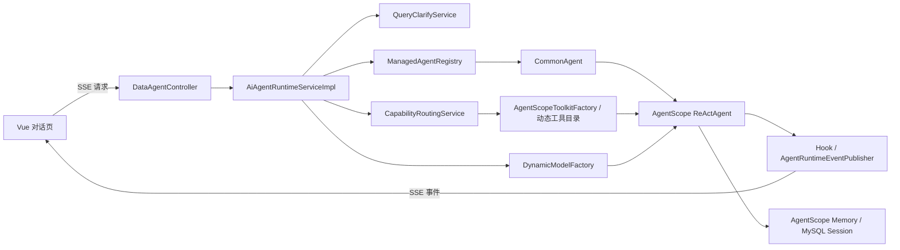

# 项目架构说明

> 本文描述当前代码中的真实主链路。历史版本中的 StateGraph 节点流水线不再是当前对话运行时架构。

## 1. 项目定位

DataAgent 是一个可独立运行的智能数据分析功能模块，不是企业级多租户平台。当前采用单体后端加单页前端的部署形态，重点解决 Agent 配置、数据源约束、自然语言问数、指标能力接入和会话展示。

现阶段不包含完整的身份认证、多租户数据隔离、企业级网关或分布式治理能力。部署时应位于本机或可信网络边界内。

## 2. 技术栈与模块

| 层次 | 当前实现 |
|---|---|
| 后端 | Java 17、Spring Boot 3.4.8、Spring WebFlux、MyBatis |
| Agent 运行时 | AgentScope 1.0.11 `ReActAgent` |
| 模型接入 | Spring AI、DashScope/OpenAI 兼容模型、动态模型配置 |
| 管理数据库 | MySQL 8、Druid |
| 向量检索 | Elasticsearch 8.18.0（当前默认）；PGVector 依赖和切换配置保留 |
| SQL 安全 | JSQLParser、Agent 数据源表/字段白名单、`sql_guard.check` |
| 前端 | Vue 3、TypeScript、Vite 5、Element Plus |
| 流式协议 | WebFlux SSE |
| 可观测性 | OpenTelemetry，可选接入 Langfuse |

仓库由两个应用模块组成：

```text
DataAgent
├── data-agent-management   # Spring Boot 后端，也是 Maven 可执行模块
├── data-agent-frontend     # Vue 3 前端，不属于 Maven reactor
├── agent-skills            # 运行时技能定义
└── docs                    # 架构、开发、状态和经验文档
```

后端没有拆成多个部署服务；Controller、Service、Mapper、AgentScope 适配和工具提供者都位于 `data-agent-management` 内。

## 3. 当前运行时主链路



主要步骤如下：

1. `DataAgentController` 接收问题、`agentId`、`threadId`、运行请求标识和可选人工反馈。
2. `AiAgentRuntimeServiceImpl` 检查取消状态和澄清条件，加载 Agent、活动模型和 AgentScope memory。
3. `AgentScopeToolkitFactory` 按 Agent 绑定的数据源、技能和知识构建基础工具集。
4. `CapabilityRoutingService` 选择数据库路径或指标混合路径，并追加对应工具和运行时规则。
5. `ManagedAgentRegistry` 固定取得 `CommonAgent`；`CommonAgent` 创建 AgentScope `ReActAgent`，由模型自主循环选择工具。
6. Hook 将文本、工具调用、工具结果和错误转换为 SSE 事件；运行结束后保存原生 memory 和可观测信息。

当前主链路不是固定节点图，也不存在“意图识别节点 → 计划节点 → SQL 节点 → Python 节点 → 报告节点”的强制顺序。工具调用次序由 `ReActAgent`、系统提示词、能力路由规则和工具返回共同决定。

## 4. Agent、Prompt 与能力路由

- 业务落库和运行时只使用 `agentType=commonagent`。
- Agent 基础提示词来自 `prompts/commonagent.md`，数据库路径规则来自 `prompts/db-path.md`。
- 业务侧 Prompt 语义收敛为系统提示词，不再按旧 StateGraph 节点维护多种 Prompt 模板。
- 指标能力启用时，路由会注册 `metric.*` 工具；数据库工具仍保留作为明确的降级路径。
- Agent 绑定的本地技能、领域知识、语义模型、数据源探索和 SQL 安全工具都通过动态工具目录注入。

## 5. 流式、会话与持久化

- 前端流式请求默认以当前 `sessionId` 作为 `threadId`。
- AgentScope 原生 memory 与 UI 可见聊天消息是两类数据；`memory-text` 只进入 memory，不直接出现在聊天消息列表。
- 当前 UI 可见消息仍由前端在流式过程中调用聊天接口保存，因此断连时可能出现运行时已执行但历史消息不完整的情况；后端统一拥有一次对话持久化属于后续整改项 `R-11`。
- 取消流程由 `runtimeRequestId` 和运行时注册表协作，既停止 SSE，也抑制取消后的 memory 写回。

## 6. 数据与检索

### 6.1 管理库

MySQL 基线共 15 张表：

`agent`, `business_knowledge`, `metric_local_config`, `semantic_model`, `agent_knowledge`, `datasource`, `logical_relation`, `agent_datasource`, `agent_preset_question`, `agent_skill_binding`, `chat_session`, `chat_message`, `agent_datasource_tables`, `agent_datasource_columns`, `model_config`。

主基线和测试基线必须同步维护：

- `data-agent-management/src/main/resources/sql/schema.sql`
- `data-agent-management/src/test/resources/sql/schema.sql`

应用默认不在启动时执行 migration；旧数据库结构需要按升级说明手工对齐。

### 6.2 向量检索

当前 `application.yml` 通过 `DATA_AGENT_VECTORSTORE_TYPE` 选择向量库，默认使用 Elasticsearch、1024 维索引和向量与关键词双路召回后的融合。PGVector 使用独立连接池和预初始化表，作为纯向量检索切换方案；应用启动只校验表结构，不自动迁移数据库。

指标目录使用独立的业务语义模型和 API 契约模型：`MetricDefinition` 只参与检索，`MetricApiContract` 只参与接口执行，二者通过稳定 `metricKey` 和 `MetricBinding` 关联。`MetricRetrievalService` 是指标问数工具与管理页检索验证的唯一公共入口，并在 Agent 作用域内按需使用 `business_knowledge` 扩展本地术语。

OpenAPI 原始语义保持只读；平台本地名称、描述、别名和上下架状态持久化在 `metric_local_config`。指标索引以 generation 先写后切换，搜索、描述和执行共享同一个活动目录快照；下架指标同时受到向量库过滤、业务检索和执行入口三层门禁。详细设计和旧库升级方式见 `docs/METRIC_CATALOG_RETRIEVAL.md`。

### 6.3 业务数据源

Agent 可连接 MySQL、PostgreSQL、Oracle、SQL Server、Hive、Dameng 和 H2 等业务库。数据源绑定可进一步限制允许访问的表和字段；生成 SQL 在执行前必须经过 AST 校验和 `sql_guard.check`。

## 7. 关键配置

当前后端端口为 `8065`，默认向量存储为 Elasticsearch、索引维度为 `1024`，管理库密码必须由外部环境提供。完整环境变量、默认值、`.env` 加载和生产约束统一维护在 `docs/CONFIGURATION.md`，本文件不复制第二份配置表。

## 8. 当前架构边界

- Web 层使用 WebFlux，但 MyBatis、JDBC 和部分 AgentScope 调用是阻塞式；当前低并发模块可运行，若出现明确吞吐问题再评估统一为 MVC + SSE 或系统隔离阻塞调用。
- 当前没有完整访问控制，不能直接作为公网或不可信共享网络服务部署。
- 模型配置和数据源配置的落库加密属于后续整改项；普通管理接口不得返回明文密钥。

## 9. 相关文档

- `docs/todolist.md`：当前整改路线图
- `docs/DEVELOPER_GUIDE.md`：开发与验证方式
- `docs/CONFIGURATION.md`：环境变量与配置参考
- `docs/DEPLOYMENT.md`：部署边界与运行检查
- `docs/UPGRADE.md`：数据库手工升级流程
- `docs/API_AND_SSE.md`：REST 入口与 SSE 协议
- `docs/ELASTICSEARCH.md`：Elasticsearch 配置和排障
- `docs/METRIC_CATALOG_RETRIEVAL.md`：指标目录、公共检索、本地修正和上下架
- `docs/KNOWLEDGE_USAGE.md`：语义模型和知识配置
- `docs/LESSONS.md`：历史问题、根因和可复用经验

`docs/duan/` 保存早期 OpenCode 修复问题时形成的调查和实施记录，仅供追溯，不作为当前架构事实来源。
