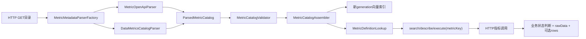

# 指标目录标准化接入技术实施方案

> 状态：v1 已实施（2026-07-24）
> 设计基线：`data-agent-metric-catalog/1.0`
> 首个供应方 Profile：`data-metrics`
> 范围：目录解析、指标主身份、HTTP执行、响应保真和管理展示

实现已覆盖标准目录解析与统一校验、`metricKey` 主身份、data-metrics 请求/响应 Profile、
原始响应保真、结果限流、管理页与工具结果展示，以及 `isNull/isNotNull` 的解析期和执行前硬拦截。
OpenAPI 解析继续作为兼容适配器保留。

## 1. 背景与目标

当前指标能力以 OpenAPI 3 文档为唯一实际输入格式，并假设一个 OpenAPI operation 对应一个指标。
新数据指标平台已经按
[第三方指标目录与 HTTP 接口接入规范](METRIC_CATALOG_INTEGRATION_SPEC.md)
提供标准目录 JSON：每项已发布指标拥有稳定 `metricKey` 和唯一固定调用路径，平台内部通用处理器
不会暴露为运行时指标选择参数。

本次改造目标：

1. 保留现有 OpenAPI 解析能力。
2. 新增 `data-agent-metric-catalog/1.0` 标准目录解析器。
3. 所有解析器输出同一个 `ParsedMetricCatalog(List<MetricCatalogEntry>)`。
4. 统一执行公共目录校验，不让来源解析器各自决定激活边界。
5. 搜索、描述和执行统一以 `metricKey` 为主身份。
6. 正确构造供应方 `filterList` 数组请求。
7. 同时判断 HTTP 状态和供应方业务状态。
8. 保留原始响应，并将可识别结果集合附加为 `rows`。

## 2. 本次明确不做

- 不支持 query、header 或 body 参数动态选择指标。
- 不建设多指标共享 Contract 和固定 `metricCode` 绑定。
- 不抽象数据库、SDK或多URL目录 Source。
- 不建设多供应方连接配置管理。
- 不支持非 HTTP Executor。
- 不引入复杂响应映射 DSL。
- 不建设目录快照和执行审计。
- 不修改 `metric_local_config` 数据库结构。
- 不修改 ES/PGVector 指标文档 Schema。

## 3. 目标链路



目录获取第一阶段仍统一为“HTTP GET一个文档字符串”。现有 `MetricOpenApiSyncService` 可以继续负责
拉取和 generation 激活；为控制改动，本轮不强制重命名。

## 4. 实施前差距（现已闭合）

| 区域 | 实施前行为 | v1 已实现行为 |
|---|---|---|
| 输入格式 | 实际只有 `openapi3` | 增加 `data-agent-catalog-v1` |
| 公共校验 | 唯一性校验在 OpenAPI Parser 内 | 所有 Parser 统一校验 |
| 工具主身份 | describe/execute 优先 operationId | 优先 `metricKey` |
| 请求数组 | OpenAPI递归展开数组item属性 | 标准目录直接保留顶层 `filterList` |
| HTTP成功 | 只依据HTTP状态 | HTTP状态 + `code=0` |
| 响应提取 | 只猜顶层 rows/data/list/items/result | 保留 rawData；Profile提取 `data.list` |
| 响应文档 | Contract只有 responseSchema | 保留描述、Schema、示例和解释提示 |
| 前端结果 | 主要显示 rows | rows优先，rawData可展开 |
| 管理页 | 展示method/path/参数 | 追加响应说明、Schema、示例 |

## 5. 领域模型调整

### 5.1 保留现有聚合结构

由于接入规范要求“一项指标一个唯一调用定义”，继续保留：

```java
public record ParsedMetricCatalog(List<MetricCatalogEntry> entries) {
}
```

不拆成 `definitions/contracts/bindings` 三张集合，也不引入共享 Contract。

`MetricCatalogEntry` 继续作为解析、运行时描述和执行的组合视图：

```text
MetricDefinition + MetricApiContract + MetricBinding
```

### 5.2 MetricDefinition

保留当前字段，调整公共校验：

- `metricKey`、`metricName` 必须非空。
- `metricCode`、description、aliases 和其他语义字段允许为空。
- 所有 list 字段继续归一化为空列表。
- 新目录不再依赖 operationId 或 path 生成 metricKey。
- 旧 OpenAPI 继续保留现有降级规则，但记录校验警告。

### 5.3 MetricApiResponse

新增响应契约：

```java
@Builder
public record MetricApiResponse(
        String description,
        String contentType,
        JsonNode schema,
        List<JsonNode> examples,
        MetricSuccessCriteria successCriteria,
        String resultPath,
        String messagePath) {
}
```

成功条件保持最小表达能力：

```java
public record MetricSuccessCriteria(
        String jsonPath,
        String operator,
        JsonNode expectedValue) {
}
```

第一阶段只支持：

```text
operator = EQ
简单JSON字段路径，如 $.code
```

这不是通用表达式执行器，不允许脚本、SpEL或任意代码。

### 5.4 MetricApiContract

目标结构：

```java
public record MetricApiContract(
        String operationId,
        String httpMethod,
        String path,
        List<MetricApiParameter> requestParameters,
        JsonNode requestSchema,
        MetricApiResponse response) {
}
```

兼容策略：

- 解析 OpenAPI 时把原 `responseSchema` 包装成 `MetricApiResponse`。
- 对外管理 DTO 可以在兼容期同时保留 `responseSchema` 只读字段，避免前端一次性破坏。
- 所有调用方迁移完成后再删除重复字段。

### 5.5 MetricQueryRequest

新增：

```java
private String metricKey;
```

标识选择顺序：

```text
metricKey > metricCode > operationId
```

旧字段保留一个兼容周期。

### 5.6 MetricQueryResult

新增：

```java
JsonNode rawData;
```

保持现有：

```text
status
summary
clarificationMessage
missingRequiredParameters
columns
rows
metadata
```

`rawData` 始终保存第三方原始业务 JSON；`rows` 是可选派生视图。

## 6. 新增标准目录解析器

新增：

```text
DataMetricsCatalogParser.java
```

建议格式名：

```text
data-agent-catalog-v1
```

解析步骤：

1. 解析根 JSON。
2. 校验 `specVersion=data-agent-metric-catalog/1.0`。
3. 读取 `sourceSystem/revision/generatedAt`，作为解析上下文。
4. 对 `metrics[]` 逐项读取 `definition` 和 `invocation`。
5. 直接使用 `invocation.parameters` 构建请求参数。
6. 不递归把 `filterList.items.properties` 变成可执行参数。
7. 将 requestSchema 原样保存为文档契约。
8. 解析 response description、Schema、examples。
9. 如果目录没有结构化解释提示，按 `sourceSystem=data-metrics` 补充：

```text
successCriteria = $.code EQ 0
resultPath      = $.data.list
messagePath     = $.msg
```

10. 构建 `MetricBinding(metricKey, operationId)`。
11. 输出 `ParsedMetricCatalog`。
12. 交给公共 Validator，Parser 自身不决定整份目录是否可激活。

类名可以先使用供应方特定名称；如果目录格式后续被第二个供应方无差异采用，再提取通用
`StandardMetricCatalogParser`，避免在只有一个真实来源时过早抽象。

## 7. 公共目录校验

新增：

```text
MetricCatalogValidator.java
MetricCatalogValidationException.java
```

统一校验：

- entries 非空。
- metricKey 非空且唯一。
- metricName 非空。
- operationId 非空且唯一。
- method 是 GET 或 POST。
- path 非空、以 `/` 开头且全目录唯一。
- path 不含协议、域名、`?` 或指标选择占位符。
- 请求中不存在动态指标选择参数。
- 所有必填参数名称、位置和类型合法。
- GET 不存在 body 参数或 requestSchema。
- POST requestSchema 是 object。
- response Schema 或 examples 至少存在一个。
- Binding 的 metricKey 和 operationId 与当前 Entry 一致。

激活位置：

```text
Parser.parse
→ MetricCatalogValidator.validate
→ MetricCatalogAssembler
→ 写入新generation
→ 原子切换lookup
```

新目录任一条失败时继续保留旧目录，不能跳过单条后激活剩余指标。

## 8. metricKey 主身份改造

### 8.1 搜索

`MetricSearchResult.Candidate` 已包含 `metricKey`，保留现有检索和排序逻辑。

### 8.2 describe工具

Schema 增加：

```json
{
  "metricKey": {
    "type": "string",
    "description": "metric.catalog.search返回的稳定指标标识"
  }
}
```

兼容保留 `metricCode/operationId`。

### 8.3 execute工具

Schema 增加 `metricKey`，模型调用流程调整为：

```text
search(query)
→ describe(metricKey)
→ execute(metricKey, arguments)
```

### 8.4 Lookup

`MetricDefinitionLookup` 继续注册兼容标识，但明确：

- metricKey 是唯一正式索引。
- metricCode/operationId/path 只用于旧调用兼容。
- 公共 Validator 已保证本轮目录中的兼容标识不存在歧义。

### 8.5 Prompt和Skill

修改 `CapabilityRoutingService` 和 `builtin-metric-system/SKILL.md`：

- 不再描述“候选指标接口”作为主身份。
- 明确 search 后必须使用候选 `metricKey`。
- describe 后依据参数说明、Schema和示例生成 arguments。
- 业务失败时根据结构化状态补参、澄清或降级，不能把失败 JSON 当成功数据解释。

## 9. 请求构造

### 9.1 顶层 filterList

data-metrics Entry 只产生一个可执行 body 参数：

```text
filterList
```

请求构造结果：

```json
{
  "filterList": []
}
```

或：

```json
{
  "filterList": [
    {
      "field": "CARRIER",
      "filterCondition": "eq",
      "filterValue": "MU"
    }
  ]
}
```

禁止生成：

```json
{
  "filterList": {
    "field": "CARRIER"
  }
}
```

### 9.2 默认值和缺参

- `filterList.defaultValue=[]` 时允许自动补空数组。
- 参数 description、requestSchema 和 example 完整返回给 describe 工具。
- LLM负责理解业务必填过滤字段。
- 平台返回业务参数错误时，执行结果不能标记 SUCCESS。
- data-metrics v1 的可执行操作符中排除 `isNull/isNotNull`。
- Parser 校验目录不得发布这两个操作符。
- Prompt和工具参数说明不得向模型暴露这两个操作符。
- 执行前检查 `filterList[*].filterCondition`，命中时返回参数错误且 HTTP 调用次数必须为0。
- 后续如需支持空值判断，按新契约版本实现，不在 v1 上追加隐式传值约定。

## 10. HTTP执行与响应解释

### 10.1 保留当前HTTP执行器

本轮继续使用 `MetricQueryExecutionService`，不抽取 Executor Registry。

执行步骤调整为：

1. 使用 metricKey 获取上架 Entry。
2. 准备和校验参数。
3. 根据 Contract 构建 path/query/header/body。
4. 执行 HTTP 请求。
5. 解析合法 JSON 为 rawData。
6. 依据 `MetricSuccessCriteria` 判断业务状态。
7. 业务失败返回明确状态和供应方 message。
8. 成功时按 resultPath 尝试提取 rows。
9. 保留 rawData，无论 rows 是否可提取。

### 10.2 状态语义

保留：

```text
SUCCESS
NEED_CLARIFICATION
FALLBACK_TO_DB
```

建议新增或在 metadata 中明确：

```text
BUSINESS_ERROR
```

推荐新增独立 `BUSINESS_ERROR`，避免把供应方明确拒绝与网络故障混成同一种降级原因。

data-metrics 判定：

```text
HTTP非2xx      → FALLBACK_TO_DB / HTTP_ERROR
HTTP 2xx code=0 → SUCCESS
HTTP 2xx code≠0 → BUSINESS_ERROR
```

业务失败是否允许回退数据库由能力路由规则决定，执行服务只报告事实，不静默重算。

### 10.3 JSON Path安全边界

第一阶段只实现点分隔的对象字段路径：

```text
$.code
$.msg
$.data.list
```

不支持：

- 过滤表达式；
- 函数；
- 脚本；
- 任意反射调用；
- 数组条件执行。

### 10.4 响应大小

新增配置：

```text
max-response-bytes
max-result-rows
```

读取前限制响应体大小；rows 超限时有界截取并在 metadata 中写明：

```text
resultTruncated=true
originalRowCount
returnedRowCount
```

rawData 是否完整返回必须同时受响应大小硬限制，不能先读取无限响应后再截断。

## 11. 管理接口和前端

### 11.1 管理DTO

`MetricCatalogView` 继续返回当前有效定义和 Contract，追加：

- response description；
- response Schema；
- response examples；
- success criteria；
- result path；
- message path。

### 11.2 指标管理页

展开区增加：

```text
指标定义
HTTP方法和固定path
请求参数
请求Schema
响应说明
响应Schema和示例
业务成功条件
主要结果路径
```

### 11.3 工具结果

`ToolResultDisplay` 展示优先级：

1. 有 rows 时显示表格。
2. rawData 始终允许折叠查看。
3. 只有 rawData 时显示格式化 JSON。
4. BUSINESS_ERROR 显示供应方 message，不渲染为成功结果。

必须覆盖：

- 流式实时展示；
- 流结束后的静默状态；
- 页面刷新后的历史消息展示。

## 12. 主要文件范围

### 12.1 后端修改

- `MetricApiContract.java`
- `MetricDefinitionLookup.java`
- `MetricMetadataParserFactory.java`
- `MetricOpenApiParser.java`
- `MetricOpenApiSyncService.java`
- `MetricQueryRequest.java`
- `MetricQueryResult.java`
- `MetricQueryExecutionService.java`
- `MetricToolProvider.java`
- `MetricCatalogQueryService.java`
- `MetricCatalogView.java`
- `MetricCapabilityProperties.java`
- `CapabilityRoutingService.java`

### 12.2 后端新增

- `MetricApiResponse.java`
- `MetricSuccessCriteria.java`
- `DataMetricsCatalogParser.java`
- `MetricCatalogValidator.java`
- `MetricCatalogValidationException.java`

### 12.3 前端修改

- `data-agent-frontend/src/services/metricCapability.ts`
- `data-agent-frontend/src/views/MetricCapability.vue`
- `data-agent-frontend/src/components/run/ToolResultDisplay.vue`

### 12.4 规则和文档

- `agent-skills/builtin-metric-system/SKILL.md`
- `docs/METRIC_CATALOG_INTEGRATION_SPEC.md`
- `docs/METRIC_CATALOG_RETRIEVAL.md`
- `docs/CONFIGURATION.md`
- `docs/API_AND_SSE.md`

实现完成前，当前行为文档不得提前写成已支持标准目录。

## 13. 测试方案

### 13.1 Parser

- 标准目录最小指标正常解析。
- data-metrics 完整示例正常解析。
- metricKey、operationId、path 重复时整份拒绝。
- 非法 path、动态指标选择参数拒绝。
- response 缺少 Schema和示例时拒绝。
- filterList 只生成一个顶层可执行参数。
- OpenAPI旧格式继续通过。

### 13.2 同步和目录

- 新格式通过 `parserFormat` 选择。
- 新目录失败保留旧 generation。
- 成功后 search/describe/execute 使用同一 Entry。
- 删除供应方指标后新目录不再包含该指标。
- 本地修正和上下架仍按 metricKey 生效。

### 13.3 执行

- execute(metricKey) 调用目录字面 path。
- 无过滤条件发送 `{"filterList":[]}`。
- 多个过滤条件保持数组结构。
- code=0 返回 SUCCESS。
- code!=0 返回 BUSINESS_ERROR。
- data.list 提取为 rows。
- rawData完整保留。
- data.list 字段动态变化不影响 rawData。
- HTTP错误和超时保持明确降级。
- 大响应和超大rows受硬限制。
- 目录包含isNull/isNotNull时校验失败。
- 模型或客户端直接传入isNull/isNotNull时执行前拒绝，指标HTTP调用次数为0。

### 13.4 工具和前端

- search候选包含metricKey。
- describe/execute优先metricKey。
- operationId旧调用兼容。
- 管理页展示完整请求/响应契约。
- rows和rawData实时展示。
- 刷新历史消息后结构不退化。

## 14. 验证命令

后端至少执行：

```bash
mvn -pl data-agent-management -am -DskipTests compile
mvn -pl data-agent-management -am test
```

涉及 Bean、配置和 Parser 注入后执行应用启动验证，确认出现：

```text
Started DataAgentApplication
```

前端执行：

```bash
cd data-agent-frontend
npm run type-check
npm run lint:check
npm run build
```

响应展示增加浏览器运行时验证，覆盖实时和历史双路径。

## 15. 实施阶段

### 阶段一：模型、解析器和校验

- 新增响应契约模型。
- 新增 DataMetricsCatalogParser。
- 新增公共 Validator。
- 保持 OpenAPI回归。

完成标准：供应方完整目录可以生成有效 Entry，重复或非法目录整份拒绝。

### 阶段二：metricKey工具链和HTTP执行

- 工具Schema增加metricKey。
- 正确发送filterList数组。
- 增加业务状态判断。
- 增加rawData和resultPath提取。

完成标准：通过metricKey调用固定path，code非0不会误报成功。

### 阶段三：管理页和结果展示

- 展示请求/响应契约。
- rows与rawData双展示。
- 更新Prompt和Skill。

完成标准：用户可以从管理页理解当前调用方式，对话结果刷新后不退化。

### 阶段四：端到端验收

- Stub目录和指标HTTP服务。
- generation失败保留旧目录。
- 工具轨迹、业务错误、响应限制和历史展示验收。

完成标准：标准目录、旧OpenAPI、正常查询、业务失败、HTTP失败和复杂响应场景全部通过。

## 16. 风险与待确认

| 风险/问题 | 处理 |
|---|---|
| HTTP 200 + 非0业务码被误判成功 | 实现successCriteria并增加回归测试 |
| filterList数组被递归展开 | 标准目录直接使用顶层parameters |
| 必填业务过滤条件仅在描述中 | describe完整暴露文档，由LLM补参，供应方负责最终校验 |
| 操作符是所有字段的并集 | LLM参考说明；业务失败结构化返回；后续可增强逐字段规则 |
| v1不支持isNull/isNotNull | Parser、工具说明和执行前硬校验三层禁止，未来通过契约升级支持 |
| rawData过大挤占模型上下文 | 响应字节和rows硬上限 |
| 旧operationId调用仍存在 | 保留兼容字段，内部优先metricKey |

## 17. 工作量评估

在不建设多来源连接、目录快照、执行审计和非HTTP Executor 的前提下，预计：

| 工作 | 估算 |
|---|---:|
| 模型、Parser、公共校验 | 2～3人日 |
| metricKey工具链、HTTP执行、响应解释 | 2～3人日 |
| 管理页、结果展示、Prompt/Skill | 1～2人日 |
| 测试、启动验证和浏览器验收 | 2～3人日 |

合计约 `7～11人日`，不包含供应方联调等待和外部环境问题。
