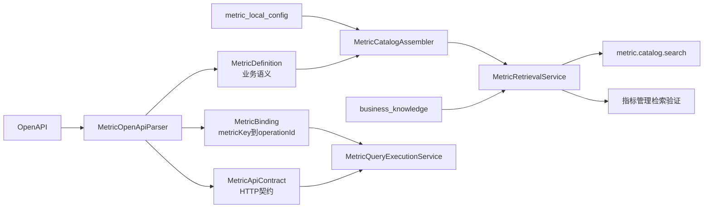

# 指标目录与检索实施方案

> 状态：第一阶段已实施。本文同时记录本次设计决策、当前实现和后续验收边界。

## 1. 工程目标

本阶段只解决四个问题：

1. 将可检索的业务指标与可执行的 OpenAPI 契约拆开。
2. 让问数工具和指标管理页复用同一个指标检索服务。
3. 允许平台管理员补充本地指标名称、描述和别名。
4. 允许指标上下架，下架后不能被搜索、描述或执行。

本阶段不建设审批流、多级指标覆盖、指标公式编辑、多租户治理或复杂执行编排。

## 2. 模型与职责



- `MetricDefinition` 只保存名称、编码、别名、描述、示例、维度和粒度等业务语义。
- `MetricApiContract` 只保存 `operationId`、HTTP 方法、路径、参数和请求/响应 Schema。
- `MetricBinding` 使用稳定 `metricKey` 绑定接口操作。
- `MetricCatalogEntry` 是同一活动目录 generation 中的组合视图，供描述和执行定位。

`metricKey` 按 `x-data-agent-metric-id → metricCode → operationId → 路径降级值` 选择。解析阶段发现空值或重复值时拒绝激活新目录。

## 3. 本地语义修正

OpenAPI 原始内容保持只读，本地修正写入 `metric_local_config`。有效定义按以下规则生成：

```text
有效名称 = 本地名称非空 ? 本地名称 : OpenAPI名称
有效描述 = 本地描述非空 ? 本地描述 : OpenAPI描述
有效别名 = OpenAPI别名 + 本地补充别名（去重）
```

本地修正只影响检索语义，不允许修改 HTTP 方法、路径、参数、鉴权和响应契约。OpenAPI 重新同步不会覆盖本地修正。

现有 `business_knowledge` 继续保持 Agent 级作用域。当用户问题明确包含已启用业务知识的业务名词或同义词时，检索服务将标准术语、同义词和描述加入检索文本；未命中时仍使用原问题，不把全部知识无条件拼入查询。

## 4. 公共检索链路

唯一公共入口是：

```java
MetricSearchResult MetricRetrievalService.search(MetricSearchCommand command)
```

`MetricToolProvider` 和 `POST /api/metric-capability/search` 都调用该方法。管理页面不实现独立排序，也不能传入不同于运行时的阈值。

检索步骤：

1. 校验问题，服务端将返回数量限制为 1～10。
2. 按 `agentId` 做高置信业务知识扩展。
3. 对指标编码、名称和别名做精确命中。
4. 使用 Elasticsearch 并行执行向量与字段加权关键词检索。
5. RRF 使用 `metricKey` 去重，写回融合分数并以 `metricKey` 稳定打破同分。
6. ES 过滤活动 generation 和 `ONLINE`，业务层再次执行上架状态硬过滤。
7. 输出 `MATCH`、`AMBIGUOUS` 或 `NO_MATCH`，并返回命中字段、分数和增强术语。

指标向量文本只包含业务语义，不再写入 HTTP 路径、参数名和请求说明。关键词分支对 `metricCode`、`metricName`、`aliases`、`description` 使用不同权重。

## 5. 上下架与硬门禁

- 首次同步的新指标默认 `ONLINE`。
- 已存在指标保留本地状态；刷新不能自动重新上架。
- `OFFLINE` 指标不写入新 generation，并同时在搜索结果和运行时目录中被过滤。
- `describe` 和 `execute` 使用 `getOnlineEntry`，直接提供指标编码或 operationId 也不能绕过下架状态。
- 下架先更新运行时硬门禁，再重建索引；上架先成功构建新索引，再切换运行时目录。

## 6. 原子目录刷新

每次 OpenAPI 同步、本地修正和上下架都会构建新的 `generation`：

1. 解析并校验 OpenAPI。
2. 合并本地配置。
3. 将全部上架指标写入新 generation。
4. 写入成功后原子切换 `MetricDefinitionLookup`。
5. 最后清理旧 generation。

新 generation 任意批次写入失败时会清理新数据并保留旧内存快照和旧索引；旧 generation 清理失败只记录告警，不影响新目录服务。

## 7. 管理接口

| 接口 | 用途 |
|---|---|
| `GET /api/metric-capability/status` | 目录、上架、下架、本地修正和 generation 状态 |
| `GET /api/metric-capability/metrics` | 查询有效指标、原始语义、本地修正和 API 绑定 |
| `GET /api/metric-capability/metrics/{metricKey}` | 指标详情 |
| `PUT /api/metric-capability/metrics/{metricKey}/override` | 保存本地名称、描述和别名 |
| `DELETE /api/metric-capability/metrics/{metricKey}/override` | 恢复 OpenAPI 原始语义 |
| `PUT /api/metric-capability/metrics/{metricKey}/service-status` | 上架或下架 |
| `POST /api/metric-capability/search` | 按真实问数检索链路诊断 |
| `POST /api/metric-capability/refresh` | 手动同步 OpenAPI |

管理页的“按问数流程检索”需要选择 Agent 才能完整复现该 Agent 的 `business_knowledge` 增强；不选择时只验证全局指标语义。

## 8. 旧库手工升级

应用不会自动修改既有数据库。升级旧 MySQL 前执行以下 DDL，完整定义也已进入 `src/main/resources/sql/schema.sql`：

```sql
CREATE TABLE IF NOT EXISTS metric_local_config (
  metric_key VARCHAR(255) NOT NULL COMMENT '稳定指标标识',
  local_metric_name VARCHAR(255) DEFAULT NULL COMMENT '本地指标名称；为空时继承OpenAPI',
  local_description TEXT COMMENT '本地指标描述；为空时继承OpenAPI',
  local_aliases TEXT COMMENT '本地补充别名，JSON数组',
  service_status VARCHAR(20) NOT NULL DEFAULT 'ONLINE' COMMENT '服务状态：ONLINE/OFFLINE',
  index_status VARCHAR(20) NOT NULL DEFAULT 'COMPLETED' COMMENT '索引状态：PENDING/COMPLETED/FAILED',
  last_error VARCHAR(500) DEFAULT NULL COMMENT '最近一次索引失败原因',
  created_time TIMESTAMP DEFAULT CURRENT_TIMESTAMP,
  updated_time TIMESTAMP DEFAULT CURRENT_TIMESTAMP ON UPDATE CURRENT_TIMESTAMP,
  PRIMARY KEY (metric_key),
  INDEX idx_metric_local_service_status (service_status),
  INDEX idx_metric_local_index_status (index_status)
) ENGINE=InnoDB COMMENT='指标本地配置表';
```

升级后手动触发一次“同步 OpenAPI”，让现有指标重新生成带 `metricKey`、`generation` 和结构化语义字段的文档。旧格式指标文档不会被活动 generation 命中，后续可按 `vectorType=metric` 清理。

## 9. 验证与后续工作

当前自动化覆盖：OpenAPI 拆分解析、指标缺参澄清、业务知识别名增强、下架检索过滤、下架执行硬门禁和能力路由。

后续 QRY 验收仍需补充：

- 真实业务问题标注集和 Top1、Recall@3、MRR、无匹配准确率基线。
- OpenAPI 拉取、解析、分批写入、激活和清理各阶段的故障注入。
- Stub 指标 HTTP、H2/MySQL 和真实 SSE 工具轨迹端到端测试。
- 基于标注集调优 `AMBIGUOUS/NO_MATCH` 阈值，避免用少量样例拍定最终参数。
